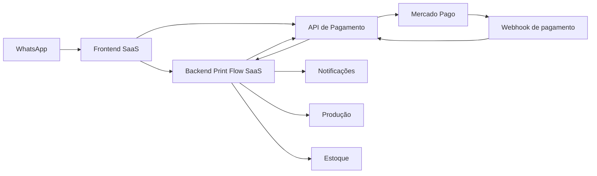

# SDD da plataforma Print Flow SaaS

Data: 2026-07-13

## 1. Contexto

A solução `print-flow-saas` será o novo produto SaaS para atendimento e vendas de gráficas. O sistema vai operar como uma camada comercial e operacional acima da API de pagamento já existente, usando essa API para gerar cobranças via Mercado Pago e receber a confirmação do pagamento.

A solução terá dois grandes blocos:

- frontend: portal operacional, atendimento, catálogo, pedidos e acompanhamento;
- backend: núcleo de domínio, integrações, automações e orquestração dos fluxos.

A API de pagamento continuará sendo o serviço financeiro especializado.

## 2. Objetivo

Entregar uma plataforma SaaS capaz de:

- atender clientes via WhatsApp;
- apresentar catálogo de produtos;
- montar orçamentos e pedidos;
- gerar cobrança via API de pagamento;
- receber o link de pagamento e reenviar ao cliente;
- acompanhar o status do pedido;
- disparar etapas de produção;
- controlar estoque;
- enviar notificações e remarketing.

## 3. Visão macro da solução

## 4. Escopo funcional do frontend

### 4.1 Painel operacional

O frontend deve permitir:

- login e identificação da empresa;
- visão do funil de atendimento;
- lista de conversas;
- abertura de pedido;
- edição de orçamento;
- acompanhamento do pagamento;
- acompanhamento da produção;
- consulta de estoque;
- histórico do cliente.

### 4.2 Jornada comercial

O operador deve conseguir:

- buscar ou criar cliente;
- selecionar produtos do catálogo;
- ajustar quantidades, dimensões e acabamentos;
- visualizar total estimado;
- aprovar orçamento;
- gerar cobrança;
- enviar link de pagamento.

### 4.3 Jornada de produção

O frontend deve permitir:

- alterar status do pedido;
- mover entre etapas de produção;
- registrar observações internas;
- consultar pendências;
- visualizar prazos e atrasos.

### 4.4 Experiência do usuário interno

O sistema precisa ter:

- dashboard com indicadores;
- lista de pedidos por status;
- detalhes completos do pedido;
- busca por cliente, número de pedido e status;
- notificações de eventos relevantes.

## 5. Escopo funcional do backend

### 5.1 Domínio principal

O backend será responsável por:

- autenticação e autorização;
- multi-tenant;
- clientes e leads;
- catálogo e precificação;
- conversas e mensagens;
- pedidos e orçamentos;
- produção;
- estoque;
- notificações;
- remarketing;
- integração com a API de pagamento.

### 5.2 Responsabilidades de integração

O backend deve:

- criar ou atualizar invoice na API de pagamento;
- solicitar criação de charge;
- armazenar `paymentUrl`;
- receber confirmação de pagamento via webhook da API de pagamento;
- alterar status do pedido após pagamento aprovado;
- disparar eventos internos para produção e notificações.

## 6. O que já existe e será reaproveitado

A API de pagamento já possui:

- `customer`;
- `invoice`;
- `charge`;
- `payment`;
- webhook do Mercado Pago;
- idempotência de pagamento;
- validação da confirmação via consulta ao gateway;
- geração de `paymentUrl`.

Isso significa que o novo SaaS não precisa reimplementar billing do zero. Ele deve consumir essa API como serviço financeiro.

## 7. O que precisa ser implementado novo

### 7.1 No frontend

- login e troca de tenant;
- dashboard operacional;
- tela de conversas;
- tela de catálogo;
- tela de pedido/orçamento;
- tela de produção;
- tela de estoque;
- tela de relatórios;
- tela de detalhes do pagamento.

### 7.2 No backend

- modelo de tenant;
- modelo de conversa;
- modelo de catálogo;
- modelo de pedido;
- modelo de etapa de produção;
- modelo de estoque;
- serviços de automação;
- contratos com a API de pagamento;
- eventos internos para orquestração.

## 8. Arquitetura sugerida

### 8.1 Camadas

- apresentação: frontend web;
- aplicação: casos de uso do backend;
- domínio: pedido, catálogo, produção, estoque e conversas;
- integração: API de pagamento, WhatsApp e notificações;
- infraestrutura: banco, filas, storage e mensageria.

### 8.2 Estratégia de integração com billing

O backend do SaaS deverá:

1. receber o pedido aprovado;
2. transformar o pedido em invoice;
3. chamar a API de pagamento para criar charge;
4. receber a URL de pagamento;
5. enviar a URL ao cliente;
6. aguardar webhook de confirmação;
7. avançar o pedido automaticamente.

## 9. Modelo de dados inicial

### 9.1 Entidades do SaaS

- `tenant`
- `user`
- `role`
- `customer_profile`
- `lead`
- `conversation`
- `conversation_message`
- `product`
- `product_category`
- `product_variant`
- `price_rule`
- `quote`
- `quote_item`
- `order`
- `order_item`
- `production_stage`
- `order_stage`
- `stock_item`
- `stock_movement`
- `notification`
- `automation_rule`

### 9.2 Integração com billing

- `order` referencia `invoice`
- `invoice` referencia `charge`
- `charge` armazena `paymentUrl`
- `payment` confirma o pagamento do pedido

## 10. Contratos de integração com a API de pagamento

### 10.1 Criar cobrança

O backend do SaaS deve enviar para a API de pagamento:

- dados do customer;
- referência externa do pedido;
- itens da invoice;
- identificação da empresa/tenant.

A resposta deve retornar:

- `invoiceId`;
- `chargeId`;
- `paymentUrl`;
- status inicial.

### 10.2 Confirmar pagamento

A API de pagamento irá:

- receber webhook do Mercado Pago;
- consultar o pagamento no gateway;
- registrar `payment`;
- atualizar `charge` e `invoice`.

O backend do SaaS deve consumir essa confirmação e mover o pedido para o próximo estado.

## 11. Fluxos principais

### 11.1 Fluxo de atendimento

1. cliente entra por WhatsApp;
2. conversa é criada;
3. o operador ou bot identifica a necessidade;
4. catálogo é consultado;
5. orçamento é montado;
6. cliente aprova.

### 11.2 Fluxo de cobrança

1. pedido aprovado;
2. backend cria invoice na API de pagamento;
3. API retorna charge e paymentUrl;
4. link é enviado ao cliente;
5. pagamento é realizado.

### 11.3 Fluxo pós-pagamento

1. Mercado Pago envia webhook;
2. API de pagamento valida e registra a confirmação;
3. backend do SaaS recebe a confirmação;
4. pedido avança para produção;
5. notificações são disparadas.

## 12. Requisitos não funcionais

- multi-tenant desde o início;
- rastreabilidade ponta a ponta;
- idempotência em integrações;
- logs e auditoria;
- arquitetura modular;
- integração resiliente com a API de pagamento;
- resposta rápida no frontend;
- segurança por perfil e tenant.

## 13. MVP sugerido

### Fase 1

- login;
- tenant;
- catálogo simples;
- pedido simples;
- integração com API de pagamento;
- geração de link de pagamento;
- confirmação de pagamento.

### Fase 2

- produção;
- estoque;
- notificações;
- automações.

### Fase 3

- remarketing;
- relatórios avançados;
- trilha comercial completa;
- melhorias de UX.

## 14. Critérios de aceite

- o frontend consegue operar pedido e pagamento;
- o backend conversa com a API de pagamento com contrato claro;
- a cobrança é gerada sem depender do operador sair do SaaS;
- o pagamento aprovado atualiza o pedido automaticamente;
- o sistema suporta evolução para múltiplas gráficas.

## 15. Riscos

- acoplamento excessivo entre atendimento e billing;
- ausência de multi-tenant no início;
- falta de evento interno para produção;
- catálogo mal modelado;
- dependência de processos manuais em excesso.

## 16. Resumo

O `print-flow-saas` deve ser um SaaS de operação e vendas para gráficas, com frontend e backend próprios, integrando-se à API de pagamento como serviço financeiro.

A estratégia ideal é manter o billing separado e construir o restante do produto ao redor dele.
